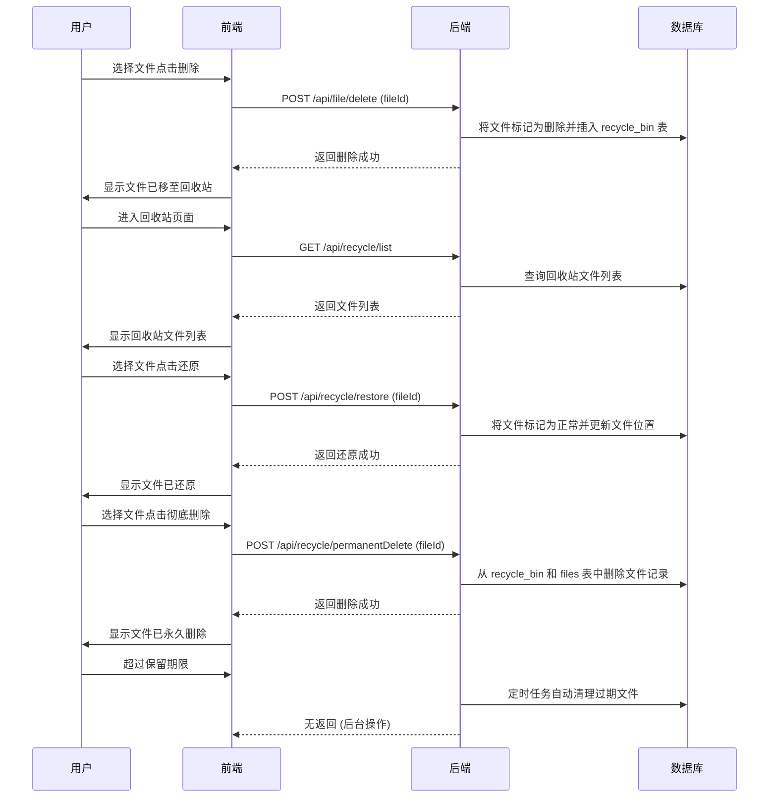
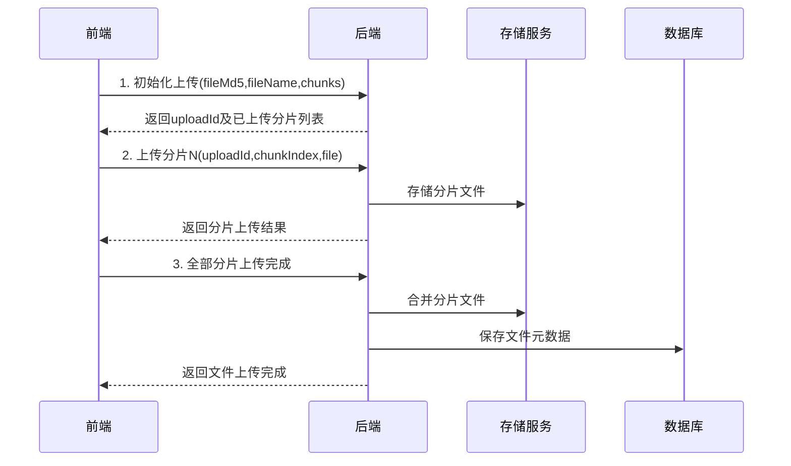
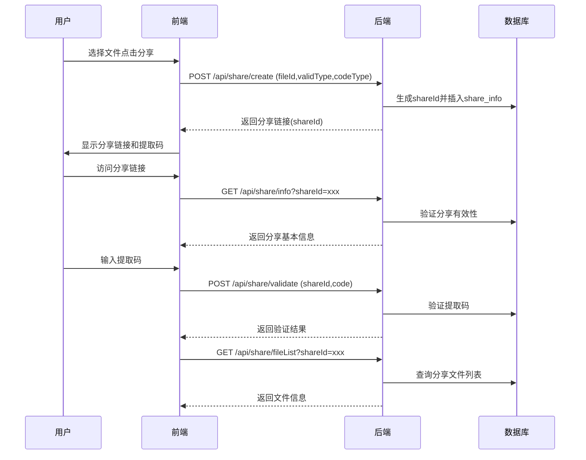

### 1、项目概述

- **项目名称**：Easy云盘
- **项目简介**：仿百度网盘实现的云存储平台，支持文件上传、下载、预览、分享、回收站管理、管理员操作等核心网盘功能，适合部署在内网或小型公有云环境中。
- **技术栈**：
  - 前端：Vue3 + Vite + Element Plus
  - 后端：Spring Boot + MyBatis Plus + JWT + Redis
  - 数据库：MySQL 8.x
  - 存储：本地存储/对象存储（OSS）
  - 部署：Nginx + Jar 包 + Supervisor + HTTPS

### 2、功能拆分

#### 2.1 用户模块

- 注册、登录、邮箱验证码、图形验证码
- Token 鉴权，密码加密（BCrypt）
- 个人信息查看与修改、空间配额展示

#### 2.2 文件模块

- 上传（支持分片、断点续传、秒传）
- 下载（单个文件/打包下载）
- 文件夹支持、新建/重命名/移动/删除
- 多类型预览（视频、图片、文档、音频、文本）

#### 2.3 分享模块

- 设置有效期、提取码
- 链接生成、访问提取、提取码校验
- 浏览、下载、预览、保存到我的网盘

#### 2.4 回收站模块

- 逻辑删除（状态标记）
- 文件还原、彻底删除
- 自动清理（定时任务）

#### 2.5 管理员后台

- 用户列表、状态切换、空间调整
- 所有文件浏览、删除（含违规内容）
- 系统参数设置（验证码模板、默认空间、邮箱服务）

### 3、流程图

#### 3.1 回收站文件处理流程图



#### 3.2 分片上传流程



**关键实现**：

1. 秒传检查：通过文件MD5查询`file_info`表，存在相同MD5且为同一用户时直接返回已有文件
2. 分片存储：使用Redis记录上传进度，Key格式：`upload:{userId}:{fileMd5}`
3. 断点续传：前端通过`GET /api/file/uploadProgress`接口查询已上传分片

#### 3.3 文件分享时序图



### 4、接口设计

​	接口文档详细参见附件  [接口文档设计](EasyPan.html)

### 5、页面设计

#### 5.1用户注册与登录

未注册用户可以通过注册功能创建账户，已注册用户可凭邮箱和密码登录。支持第三方登录方式（例如QQ登录）以及找回密码功能。所有用户相关操作均需进行基本验证，例如图形验证码和邮箱验证码，以确保安全性。
 *登录页面：用户输入注册邮箱和密码登录。支持“记住我”选项以及第三方QQ快速登录。右侧提供“忘记密码？”和“没有账号？去注册”链接。下方有图形验证码输入框，防止恶意登录尝试。*

- **登录：** 用户使用邮箱和密码登录，登录表单需输入**邮箱**、**密码**以及页面提供的**图形验证码**。密码在前端进行MD5散列后传输，提高安全性 ([EasyPan(1).html](file://xn--file-dzcht9xmyu9zqsgnjajdrk%23:~:text=ary":"","deprecated":false,"description":"```text\n\n```\n","tags":["eas ypan%2F"],"parameters":[],"requestbody":{"content":{"multipart%2Fform,nick-25993amy2j9uzwmcas717jz69cyp0a512yjdmoqcax4143dssod/))。登录接口校验凭证后，返回用户基本信息和会话令牌。支持QQ一键登录功能，点击“快速登录 (QQ)”跳转QQ授权。登录成功后进入用户网盘主页。


 *注册页面：新用户填写邮箱、收到的邮箱验证码、昵称、密码和确认密码，并输入图形验证码完成注册。点击“获取验证码”按钮发送邮件验证码。*

- **注册：** 新用户填写注册表单，需提供**邮箱**、**昵称**、**密码**及**确认密码**，并输入**图形验证码**和**邮箱验证码**完成验证。首次点击“获取验证码”按钮后，会向填写的邮箱发送一封包含6位数字验证码的邮件 。注册接口会校验邮箱验证码和图形验证码有效性，然后创建用户账户，默认分配一定的存储空间（如初始5GB）。注册邮箱需唯一，密码需符合复杂度要求（8-18位，包含字母数字或特殊字符）。注册成功后可直接登录或跳转到登录页。


 *找回密码页面：用户输入注册邮箱并获取邮箱验证码，设置新密码并再次输入确认，同时填写图形验证码。验证通过后即可重置密码。*

- **找回密码：** 当用户忘记密码时，可通过邮箱重置。流程与注册类似：输入注册邮箱，点击获取验证码后，系统发送重置密码的邮箱验证码；用户填写收到的验证码、新密码以及**图形验证码**，提交后即重置密码成功 。新密码设置成功后，可用于后续登录。找回密码链接通常在登录页提供快捷入口。


 *发送邮箱验证码弹窗：在注册或找回密码流程中，用户点击“获取验证码”后弹出此对话框，需要输入图形验证码以发送邮件。防止恶意反复请求邮件验证码。*

- **验证码获取：** 无论注册还是找回密码，当用户点击“获取验证码”按钮时，会弹出如上图所示的验证对话框，要求输入一次**图形验证码**后才能发送邮件验证码。这一机制防止恶意重复请求邮件。邮件内容和标题可在后台“系统设置”中配置，例如默认标题是“邮箱验证码”，内容模板如“你好，您的邮箱验证码是：%s，15分钟有效”。图形验证码通过`GET /api/checkCode`接口获取（`type=0`用于注册/登录页面） 。邮箱验证码发送通过`POST /api/sendEmailCode`接口，需提交邮箱地址和图形验证码 。每封验证码邮件有效期一般为15分钟。

  

**（注意：）**登录、注册和找回密码等接口的详细参数见后文“接口文档”部分，例如注册接口`/api/register`要求提供邮箱、昵称、密码、图形验证码和邮箱验证码 。用户登录状态维持可采用 Token 机制，用户每次请求需在请求头附加授权 Token。支持用户注销登录（调用`GET /api/logout`接口，销毁会话）。


#### 5.2 网盘主页

 

- ***网盘主界面**：左侧为分类筛选（全部、视频、音乐、图片、文档、其他），中上方为操作按钮（上传、新建文件夹、批量删除、批量移动）和搜索框。右侧主区域显示当前目录的文件列表（如图为空目录时提示上传文件)。底部显示存储空间使用情况。*

- **文件列表：** 网盘主页默认显示用户“全部文件”目录下的内容。左侧提供六类文件筛选标签：**全部**、**视频**、**音乐**、**图片**、**文档**、**其他**。用户点击不同分类，可以按文件类型过滤列表显示（例如只看图片或文档）。
- **新建文件夹：** 用户点击“新建文件夹”按钮，可在当前目录下创建子文件夹。系统会弹出输入框让用户填写文件夹名称，如下图所示。文件夹创建接口`POST /api/file/newFolder`需要提供父目录ID（`filePid`）和文件夹名称（`fileName`） 。创建成功后，页面文件列表刷新显示新文件夹条目。

 *新建文件夹：在文件列表顶部出现文件夹名称输入栏，用户输入名称后点击勾号确认或叉号取消。确认后将调用后台接口创建该目录。*

- **文件排序与分页：** 文件列表默认按照名称或时间排序，可实现点击列头排序（如果有提供）。当文件众多时支持分页浏览，每页默认显示一定数量（如15个） 。分页参数通过接口传递（如`pageNo`第几页，`pageSize`每页条数）。接口返回总条目数和总页数便于前端渲染分页控件。

#### 5.3 文件上传与下载

- **批量上传：** 用户点击“上传”按钮后，在文件选择框中可多选一个或多个文件开始上传。上传过程中，界面会出现一个“上传任务列表”侧栏，展示每个文件的上传状态和进度条。例如下图所示，有多个文件同时上传，每个文件右侧显示进度百分比，文件名下方标注状态（“上传完成”或“秒传完成”表示上传成功，“暂停中”表示用户暂停，“上传失败”则会显示错误原因）。用户可在上传列表中取消某个正在上传的文件。已完成或取消的任务可从列表中清除。

 

- ***批量上传任务列表**：用户一次性选择多个文件后，右侧显示上传进度列表。支持大文件分片上传，进度条显示每个文件已上传的分片比例。部分文件标记“秒传完成”表示服务器已存在相同文件，无需重复上传即完成。用户可以暂停或取消任务。下方分别显示不同文件的上传状态。*

 

- ***文件列表显示上传后的文件**：如图上传完成后，“全部文件”目录下显示新上传的文件条目，包括其大小和上传时间等信息。用户可以通过左侧的“视频”“文档”等分类过滤这些文件。*

- **文件下载：** 用户可以下载自己网盘中的文件。下载有两种方式：

  1. **单个文件下载：** 在文件列表中选中某个文件，点击操作中的“下载”按钮，浏览器将开始下载该文件。例如上图中，用户点击名为“小鲤鱼历险记.mp3”的文件的“下载”按钮（红框标出）后，浏览器出现下载提示。系统通过`GET /api/file/download`接口返回文件内容流或下载链接，触发浏览器下载功能。

     

  2. **批量打包下载：** 如果支持多选，用户可以勾选多个文件后点击“批量下载”（界面中可能通过压缩打包实现）。本系统当前界面提供批量删除和移动，没有直接批量下载按钮，但用户可以逐个下载多个文件。如果需要批量下载，可由前端发送请求将多个文件打包成ZIP后提供单一下载。

#### 5.4 文件预览与操作

**文件预览：** 系统支持多种常见格式文件的在线预览，用户无需下载即可在浏览器中查看内容。支持的预览类型包括：视频（mp4等）、音频(mp3等)、图片(jpg/png/gif等)、文档（PDF、Word、Excel等，通过内置阅读器或第三方预览服务）、文本文件（txt、代码文件等以文本方式显示） 。对于这些支持预览的文件，用户点击文件名会在页面中打开预览窗口。预览窗口通常以弹层形式覆盖当前页面，并提供基本的查看控制，例如视频的播放/暂停、音频的播放控件、文档的翻页或缩放等，以及一个关闭按钮返回文件列表。

 *视频文件在线预览：用户点击一个MP4视频文件，弹出播放器窗口直接播放视频内容。“什么是微信小程序”幻灯片为视频内容示例，下方有播放进度控制。*

如上图，用户点击某视频文件后，页面中央出现视频播放器，支持播放/暂停、进度拖动、全屏等操作。视频文件是在服务器端以流式传输的方式发送，浏览器使用元素播放。音频文件预览类似。

 *音频文件在线预览：图示为MP3音频的播放器界面，有专辑封面图片（如有)和播放进度条等。用户可以播放/暂停音频，查看时长等信息。*

音频文件点击后，会出现如上图的音频播放器（通常位于弹窗中部），可以播放背景音乐或语音文件。界面显示音频文件名和简单控制。

 *图片文件预览：以PNG图片为例，点击后在弹窗中央显示图片本身。背景半透明暗化当前界面，底部提供缩放查看的工具栏。*

图片文件点击后直接以图像形式显示，用户可以放大缩小或旋转（如果实现了这些功能）。文本文件和部分文档会以文字内容预览，例如代码文件会有高亮显示功能：

 *文本/代码文件预览：如图，用户点击一个`.txt`或代码文件，在浏览器中看到文本内容。支持选择不同字符编码查看（防止乱码)，并提供“复制”按钮快速复制全文。*

上图展示了一个文本文件（uploader.txt，其中包含Vue组件代码）的在线预览界面。顶部有编码切换和复制功能。如果出现乱码可尝试切换编码（如UTF-8、GBK等）。**Office文档（Word、Excel、PPT）和 PDF** 可以通过集成第三方预览服务或将其转换为HTML在浏览器中呈现；本系统支持 Excel、Doc、PDF 在线预览 。当用户打开这些文档类型时，系统会在后台将其转为PDF或图片，再在前端显示；或者利用浏览器自带能力直接显示PDF。

**文件操作：** 除了预览，用户可以对文件执行多种管理操作，包括**重命名、移动、删除**等。以下逐一说明：


- **重命名：** 用户在文件列表中选择“重命名”功能（例如点击文件行尾的“重命名”图标），文件名变为可编辑状态，如下图所示。用户输入新名称后按确认✓提交或✗取消。系统调用`POST /api/file/rename`接口修改文件名称，需要提供文件ID和新名称 。若重命名成功，列表即时更新名称。 例如上图，用户正在将文件“清单.xlsx”重命名，在名称后输入“(重命名)”作为新名称的一部分。

 *文件重命名操作：选中某文件后，名称区域变为输入框，用户可输入新名称并点击勾号提交。图中将“清单.xlsx”重命名为“清单(重命名).xlsx”。*

- **移动（剪切/粘贴）：** 支持将文件或文件夹移动到其他目录。用户可以单选或多选文件，然后点击“批量移动”按钮。会弹出目标位置选择框，列出用户所有文件夹的层次结构，供选择移动的目的地。如下面两图所示：用户选择了两个文件准备移动，弹出“移动到”对话框，用户浏览文件夹树并指定目标文件夹，然后确认执行移动。红框标出了批量移动按钮和单个文件的“移动”选项。

 *批量移动文件：弹出的“移动到”对话框中，用户可选择目标文件夹（如“新建文件夹(批量移动)”)。点击“移动到此”将所选文件移动过去。对话框顶部提供返回上一级和当前路径导航。*

移动文件请求由`POST /api/file/moveFile`接口处理，需提供所选文件ID列表和目标文件夹ID 。如果用户试图将文件移动到其所在的当前目录，前端会提示“不可移动” 。移动成功后，源目录列表移除该文件，目标目录中可看到新迁入的文件：

 *移动完成：进入目标文件夹“新建文件夹(批量移动)”后，可看到红框标出的刚才移动进来的文件列表。*

- **删除：** 用户可删除单个文件或批量删除选定的多个文件。删除操作将文件移入**回收站**而非直接删除永久销毁。用户在文件列表中点击“删除”后，会弹出确认提示框（如下图），提示“删除的文件将在10天内彻底删除”。确认后，调用`POST /api/file/delFile`接口将文件状态标记为删除并移动至回收站 。例如：

 *删除文件：选中单个文件，点击删除图标，系统询问确认。上图红框标出单文件删除按钮。*

 *批量删除文件：对勾选的多个文件点击“批量删除”按钮，会弹出确认对话框提示这些文件将进入回收站并在10天后永久删除。用户确认后，所选文件从当前列表消失并进入回收站。*

删除到回收站的机制确保用户可以在一定期限（默认10天）内还原误删文件。进入回收站的文件在数据库中标记状态为删除，实际文件仍保留在存储中直到超期或被彻底删除。后端提供回收站相关接口供查询和还原（详见后文）。在文件列表界面，删除操作后会自动刷新当前列表去掉已删除项，同时“回收站”页面能看到新进入的记录。

#### 5.5 文件分享

文件分享模块允许用户将网盘中的文件生成分享链接，其他持有该链接的人可以通过浏览器访问文件。分享功能包括：创建分享（设置有效期和提取码）、获取分享链接、取消分享，以及分享链接的访问页面（提取码验证、浏览文件、下载或保存等）。分享分为**内部分享管理**（登录用户管理自己分享的文件）和**外部分享访问**（未登录用户通过链接访问分享）。

- **创建分享链接：** 在网盘主页，用户选中想分享的文件，点击“分享”操作。弹出“分享”设置对话框，用户可以选择**有效期**和**提取码**模式。下图示例中，用户分享文件“uploader.txt”，可选有效期为“永久有效”或1天/7天/30天等，提取码可以**自定义**（用户自行设置4-6位代码）或**系统随机生成**。用户设定后点击确认生成分享。


*设置文件分享：用户勾选“永久有效”的有效期，并选择“自定义”提取码模式然后输入提取码（如未输入则不会创建链接)。*

分享创建接口`POST /api/share/shareFile`会接受文件ID、有效期类型（如0表示永久，1表示1天等）以及用户自定义的提取码（如果有）。服务器生成唯一的分享ID和对应的提取码（若用户未自定义则随机生成），保存分享记录，包括分享者、文件引用、有效期和提取码等信息，然后返回分享链接。

 *分享链接生成：系统返回生成的分享链接URL和提取码。用户可以一键复制“链接及提取码”并发送给他人。*

如上图，分享创建成功后弹窗显示**分享链接**（如`http://<域名>/share/RcfqPK...`这种格式）和**提取码**（例如12345）。用户可点击“复制链接及提取码”按钮快速复制完整分享信息。当勾选“不需要提取码”时（即系统随机但不提供给用户？实际一般至少系统也会给出提取码），本项目实现上总是会有提取码，除非在设置时允许空码。

- **分享管理（内部）:** 登录用户可以在“分享”页面查看自己已分享的文件列表，以及执行**复制链接**和**取消分享**操作。如下图所示“分享记录”列表，每条记录包含文件名、分享时间、失效时间、浏览次数等。用户点击“复制链接”可以再次获取该分享的链接和提取码，点击“取消分享”则立即让该链接失效。

 *分享管理页面：显示当前用户（admin)的所有分享记录。可以看到“uploader.txt”设为永久有效且已被访问1次，“video1.mp4”有效期到具体日期且浏览1次。操作列提供“复制链接”和“取消分享”。*

“分享记录”页面通过`POST /api/share/loadShareList`接口获取当前用户的分享列表 。取消分享调用`POST /api/share/cancelShare`，提交要取消的分享ID列表 。取消后，该分享链接将不再可用（后端会删除分享记录或标记失效）。浏览次数会在每次外部访问时累加记录，以供分享者查看分享的访问情况。

- **分享访问（外部分享）：** 未登录用户或任何获得分享链接的人，可以在浏览器访问该URL查看文件。默认需要输入分享者设置的**提取码**才可访问文件内容。如果分享时设置为无提取码（公开链接），则会直接显示内容页。访问流程如下：

  1. **访问分享链接：** 用户点击分享URL（例如`.../share/RcfqPK...`），系统呈现一个分享页面。页面显示该分享的基本信息（分享者昵称、分享时间、分享的文件名/文件夹名），并要求输入提取码进行验证。 如下图，访问者需要在输入框中填写正确的提取码才能“提取文件”。

   *分享链接提取码验证页：显示分享者昵称（admin)和分享时间，分享文件名为uploader.txt。要求访问者输入提取码后点击“提取文件”按钮。只有提取码正确才能继续。*

  1. **提取码验证：** 访问者输入提取码后提交，前端调用`POST /api/showShare/checkCode`接口验证。若提取码正确，服务器返回通过，此时前端进入文件浏览页面；若错误，则提示提取码不正确需重试。每个分享ID通常有验证次数限制，以防暴力猜码。
  2. **浏览分享文件：** 提取码正确后，系统显示分享的文件内容列表。 如果分享的是单个文件，可能直接显示文件名和下载按钮；如果分享的是一个文件夹，列表中会显示该文件夹下的所有文件。访问者可以选择**下载文件**或**在线预览**（若文件格式支持）。如下图，admin分享的uploader.txt文件（文本文件）列出在页面，提供“下载”链接。此外右上角有“保存到我的网盘”按钮，供已登录的访问者（当前浏览器可能已登录某账号)将该文件保存进自己的云盘。

   *分享文件列表页：显示分享者admin的文件列表（此例仅一个文件)，访问者可点击“下载”获取文件。右上角的“保存到我的网盘”按钮针对登录用户，允许将该文件复制到自己的网盘。*

  在此页面，未登录用户只能下载或预览文件；如果访问者此时登录了自己账号，则可以使用“保存到我的网盘”功能（详见下述）。 访问页面在后台由`POST /api/showShare/getShareInfo`接口提供数据，返回分享文件的列表、文件属性以及分享者信息等 。如果分享的是文件夹，会有文件夹内列表数据。对于可以预览的文件，访问者点击文件名会在浏览器中打开预览（类似上述网盘预览功能），例如：

   *通过分享链接在线预览文件：上图为在分享页面直接查看文本文件内容的效果，和网盘内预览类似。访问者也可以选择直接下载而不预览。*

  1. **保存到我的网盘：** 当访问者已经登录（例如以用户test登录）并查看他人分享文件时，可以将该分享文件保存到自己网盘账户中。点击“保存到我的网盘”按钮，会弹出目标路径选择对话框，用户选择自己网盘的某个文件夹并确认后，系统将在后台复制该文件的数据到用户网盘中。下图为选择保存位置的对话框示例：

   *保存到网盘：弹出“移动到”对话框（与移动文件界面类似)供用户选择将文件保存到自己网盘的哪个目录。选定后点击“移动到此”开始保存。*

  前端调用`POST /api/showShare/saveShare`接口提交分享ID、所选文件（可批量）以及自己网盘的目标文件夹ID 。服务器会将分享文件复制一份到该用户的存储空间，并在其网盘文件列表中新建记录。复制成功后用户即可在网盘中看到该文件。 下图展示用户test的网盘中出现了红框标出的保存文件：

   *保存完成：在用户test网盘的文件列表中（右上角标注为用户test)，可以看到刚才从admin分享中保存的文件“uploader.txt”。*

  （**注意**：为实现保存功能，后端需要根据分享ID和文件ID读取源文件内容，再写入目标用户的文件目录中。接口要求参数包括`shareId`和`shareFileIds`（可以一次保存多个文件）以及目标目录ID `myFolderId` 。）

分享链接在有效期到达后会自动失效（他人访问将提示链接已失效）。分享者也可随时取消分享。整个分享流程中，确保只有持有正确提取码的人才能访问文件，保障了一定程度的安全性。

#### 5.6 回收站

回收站用于管理用户删除的文件。功能包括查看已删除文件列表、还原文件、彻底删除文件。被删除的文件将在回收站保留一段时间（默认10天），超期后系统可自动清理或由管理员批量清理。

 *回收站页面：左侧提示“回收站为你保存10天内删除的文件”。右侧列出删除的文件及删除时间。提供“还原”和“批量删除”按钮。*

- **查看回收站：** 用户点击左侧菜单“回收站”进入该页面。通过`POST /api/recycle/loadRecycleList`接口获取属于自己的已删文件列表 。列表包括文件名、原所在路径（可能实现为隐藏列或提示信息）、删除时间、大小等。回收站中的文件不占用用户空间配额或者继续占用（通常仍算占用，因为文件还存在，只是不可见），这由实现决定。界面上方有两个操作按钮：“还原”和“批量删除”。
- **还原文件：** 用户选中一个或多个删除的文件，点击“还原”按钮，即可将这些文件恢复到原先删除前的位置。调用`POST /api/recycle/recoverFile`接口，提交需要还原的文件ID列表。服务端会将这些文件的状态标记为正常，并移动回原父目录。如果原目录已不存在（例如原文件夹已被删除），可将文件还原到用户根目录或者提示无法还原。还原成功后，用户可以在网盘主页相应位置重新看到该文件；回收站列表则移除该条目。
- **彻底删除：** 用户也可在回收站中彻底删除文件，使其无法再恢复。选中目标文件，点击“批量删除”按钮（红色），系统弹出确认提示后，调用`POST /api/recycle/delFile`接口删除 。彻底删除会移除文件的所有数据，占用空间释放。此操作不可撤销。通常也支持单个文件的彻底删除（界面可能在每行提供“删除”按钮或者通过批量删除实现单个）。彻底删除后，该文件从回收站列表消失。服务器也许会真正删除存储上的文件数据或者做延迟清理。

回收站确保误删文件可以自助找回，提高数据安全。系统应在文件删除10天后自动调用批量彻底删除（可通过定时任务实现），因此在回收站界面会显示剩余天数提醒或统一说明“删除的文件将在10天后自动删除”。

#### 5.7 后台管理

后台管理模块仅对管理员账号开放。管理员登录后可以进入**设置**页面，包括三个子模块：**用户文件管理**、**用户管理**、**系统设置**。管理员可以查看并操作所有用户的文件，管理用户账户状态和配额，以及调整系统全局设置如邮件模板、默认空间大小等。

- **用户文件管理：** 管理员能够查看所有用户上传的文件列表，并执行管理操作。如下图，管理员在“用户文件”栏目下看到全体文件列表，增加了一列“发布人”显示文件属于哪个用户。管理员可以通过搜索框按文件名或用户筛选文件，并可对文件执行**批量删除**或预览查看等操作。比如，可帮助删除违法内容文件。点击文件名前的用户头像/昵称，可能可以跳转查看该用户的所有文件。批量删除文件会调用相应接口，将指定用户的文件移入其回收站或直接删除。管理员查看文件列表使用接口`POST /api/admin/loadAllFiles`或类似功能（项目实现可能复用普通文件列表接口但具有管理员权限可查看全部用户文件）。如图底部显示总文件数和分页。管理员也可点选文件然后点击“批量删除”来彻底删除用户文件。预览功能类似普通用户的预览，但管理员只读浏览。

  

- **用户管理：** 管理员可以查看当前注册的所有用户账户信息，并进行检索和状态变更。下图显示用户管理界面：列出了admin和test两个用户，包括头像、昵称、邮箱、已用/总空间、加入时间、最后登录时间、以及当前状态。管理员可以通过上方筛选“状态”或昵称关键字查找用户。对每个用户有操作按钮，比如“分配空间”或“修改配额”、和“禁用/启用”用户。

  - *查询用户：* 页面通过`POST /api/admin/loadUserList`接口获取用户列表 。可选提供筛选参数如状态（启用/禁用）或昵称模糊匹配 。

  - *分配空间：* 管理员可调整用户的总可用空间大小。点击“分配空间”操作会弹出输入框允许设置该用户的新空间上限（单位如GB）。确认后，调用`POST /api/admin/updateUserSpace`接口提交用户ID和新的空间值 。服务器更新用户配额信息。调整后列表会更新“空间使用”列（例如test用户原先10GB可改为5GB等）。

  - *禁用/启用用户：* 点击“禁用”会暂时冻结该用户账号的登录和操作权限。接口`POST /api/admin/updateUserStatus`修改用户状态为禁用 。被禁用用户将无法登录或其Token立即失效。再次点击会变为“启用”以恢复正常。管理员可用此功能封锁违规用户。

    

- **系统设置：** 管理员可以调整系统级别的一些配置项，如注册邮件模板和用户默认空间大小。 如下图，“系统设置”界面提供若干输入项：

  - 注册的邮件标题（如默认“邮箱验证码”）。
  - 注册的邮件内容模板（如“你好，您的邮箱验证码是：%s，15分钟有效” – 其中`%s`为验证码占位符）。
  - 初始空间大小（新用户注册时默认分配的空间配额，例如5，即5GB）。

  管理员修改这些字段后点击“保存”，将通过`POST /api/admin/saveSysSettings`接口提交 。服务器保存这些配置，并在后续注册或发送验证码邮件时采用新的模板或参数。比如将默认空间从5改为10，新注册用户totalSpace将为10GB。邮件模板更改后，邮件发送接口返回的内容将根据新模板生成验证码邮件。系统设置变更通常对已存在用户无影响（除非修改初始空间不会自动改变已有用户配额，只作用于新用户）。

  

后台管理模块确保管理员能够监督系统资源使用及用户行为，维护系统安全与稳定。例如，管理员可以定期巡查用户文件，清理违规内容，或扩容某些用户的存储空间。此模块也可以扩展更多功能，如查看系统总体存储占用、日志审计等。

### 6、数据库设计

详细数据库设计见附件

主要包括数据库架构，表结构设计，表关系等内容

[数据库设计文档](数据库设计.md)

### 7、安全设计

1. **认证机制**：
   - JWT令牌有效期：2小时
   - 刷新令牌机制：通过`/api/auth/refresh`接口更新令牌
   - 敏感操作（删除、密码修改）需要二次验证

2. **防攻击措施**：
   - 文件上传：限制文件类型、扫描恶意内容
   - API限流：Guava RateLimiter控制关键接口调用频率
   - SQL注入：MyBatis使用参数化查询
   - XSS防护：前端DOMPurify过滤用户输入


### 8、性能设计

| 类别     | 说明                                                      |
| -------- | --------------------------------------------------------- |
| 性能     | 支持并发用户数 200+，文件上传 ≤ 5GB，下载支持限速/CDN缓存 |
| 安全性   | HTTPS、Token认证、SQL注入/XSS防护、图形验证码             |
| 可维护性 | 代码模块清晰、日志追踪、接口文档完善、注释率 ≥ 80%        |
| 可扩展性 | 文件存储支持 OSS、用户分组、团队协作等扩展功能            |
